## SpaDOT Tutorial

**Authors:**  
[Wenjing Ma](https://marvinquiet.github.io/) (wenjinma@umich.edu), Department of Biostatistics, University of Michigan  
Siyu Hou, Department of Biostatistics, University of Michigan  
[Lulu Shang](https://lulushang.org/), Department of Biostatistics, MD Anderson Cancer Center  
[Jiaying Lu](https://lujiaying.github.io/), Center for Data Science, School of Nursing, Emory University  
[Xiang Zhou](https://xiangzhou.github.io/), Department of Biostatistics, University of Michigan  

**Maintainer:** [Wenjing Ma](https://marvinquiet.github.io/) (wenjinma@umich.edu)

**Latest revision:** 05/03/2025

# Table of Contents
- [Introduction](#introduction)
- [Installation](#installation)
- [Example 1: developing chicken heart](#example-1-developing-chicken-heart)
- [Conclusion](#conclusion)

# Introduction

Spatiotemporal transcriptomics is an emerging and powerful approach that adds a temporal dimension to traditional spatial transcriptomics, thus enabling the characterization of dynamic changes in tissue architecture during development or disease progression. Tissue architecture is generally organized into spatial domains -- regions within a tissue characterized by relatively similar gene expression profiles that often correspond to distinct biological functions. Crucially, these spatial domains are not static; rather, they undergo complex temporal dynamics during development, differentiation, and disease progression, resulting in emergence, disappearance, splitting, and merging of domains over time. Therefore, we develop SpaDOT (**Spa**tial **DO**main **T**ransition detection), a novel and scalable machine learning method for identifying spatial domains and inferring their temporal dynamics in spatiotemporal transcriptomics studies.

<!-- 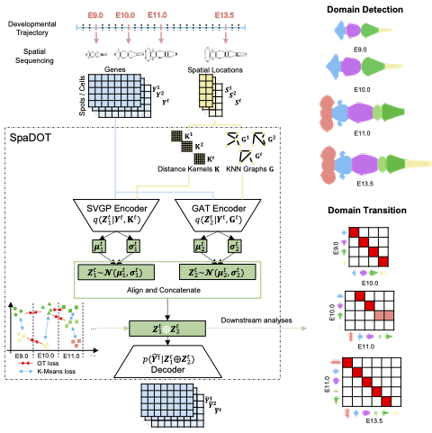 -->
<p align="center">
  
</p>

(The figure illustrates how SpaDOT works. SpaDOT adopts an integration of two complementary encoders, a Gaussian Process kernel and a Graph Attention Transformer, within one variational autoencoder framework to obtain spatially aware latent representations. The latent representations are further constrained by clustering within each time point and optimal transport (OT) coupling across time points, enabling SpaDOT to identify spatial domains and capture domain transition dynamics. )

In this tutorial, we provide detailed instructions for SpaDOT by utilizing two real data applications: a developing chicken heart sequenced by 10X Vision and a developing mouse brain sequenced by Stereo-seq. 

# Installation

**Step 1**: SpaDOT is developed as a Python package. You will have to install Python, and the recommended version is **Python 3.9**. SpaDOT also incorporates an R package [SPARK-X](https://github.com/xzhoulab/SPARK) to perform feature selection as an option. Having the spatial variable genes selected is a practice that we test can generate better results. Therefore, installiation of R and SPARK-X is recommended.

**Step 2**: Use the following command to install SpaDOT:

```shell
pip install SpaDOT
```
The installation will take seconds to finish and the software dependencies have been taken care of by pip. We have tested our package on Windows, MacOS, and Linux. 

**Step 3**: If you have successfully installed SpaDOT, you can try the following command:

```shell
## Check the help documentation of SpaDOT
SpaDOT -h 
```

You should see the following console output:

```
usage: SpaDOT [-h] {preprocess,train,analyze} ...

SpaDOT: Spatial DOmain Transition detection for spatiotemporal transcriptomics studies.

positional arguments:
  {preprocess,train,analyze}
                        sub-command help.
    preprocess          Perform data preprocessing and feature selection (optional).
    train               Train SpaDOT model and obtain latent space.
    analyze             Use obtained latent space to perform domain detection and domain dynamics detection.

optional arguments:
  -h, --help            show this help message and exit
```

In each module, you can use `-h` to show related help pages. For example, `SpaDOT preprocess -h`.

**Step 4 (Optional):** If you would like to use SpaDOT with-in program, you can do the following and pass the correct arguments into corresponding functions.

```
import SpaDOT

data_dir = "./examples"
# create arguments for preprocessing
class Args:
    data = os.path.join(data_dir, "ChickenHeart.h5ad")
    prefix = "preprocessed_"
    feature_selection = True
args = Args()
# create output directory if not exists
if 'output_dir' not in args.__dict__:
    args.output_dir = os.path.dirname(args.data)
if not os.path.exists(args.output_dir):
    os.makedirs(args.output_dir)
SpaDOT.preprocess(args)

# create arguments for training
class Args:
    data = os.path.join(data_dir, "preprocessed_ChickenHeart.h5ad")
    prefix = ""
    config = None
    save_model = True
args = Args()
SpaDOT.train(args) 

# create arguments for analyses
class Args:
    data = os.path.join(data_dir, "latent.h5ad")
    prefix = ""
    n_clusters = [5, 7, 7, 6]
args = Args()
SpaDOT.analyze(args)
```

---

# Example 1: developing chicken heart

The [developing chicken heart](https://doi.org/10.1038/s41467-021-21892-z) is measured by 10X Visium and collected from four stages: Day 4, Day 7, Day 10 and Day 14. In this dataset, SpaDOT accurately identifies valvulogenesis - a valve splits into artrioventricular valve and semilunar valve at Day 14.

**Step 1: obtain example data**

First, we downloaded the spatial transcritpomics data from [GSE149457](https://www.ncbi.nlm.nih.gov/geo/query/acc.cgi?acc=GSE149457) and selected 
```
GSM4502482_chicken_heart_spatial_RNAseq_D4_filtered_feature_bc_matrix.h5
GSM4502483_chicken_heart_spatial_RNAseq_D7_filtered_feature_bc_matrix.h5
GSM4502484_chicken_heart_spatial_RNAseq_D10_filtered_feature_bc_matrix.h5
GSM4502485_chicken_heart_spatial_RNAseq_D14_filtered_feature_bc_matrix.h5
```

Second, we downloaded spatial coordinates from the analysis code shared by the paper on [Github](https://github.com/madhavmantri/chicken_heart/tree/master/data/chicken_heart_spatial_RNAseq_processed):

```
chicken_heart_spatial_RNAseq_D4_tissue_positions_list.csv
chicken_heart_spatial_RNAseq_D7_tissue_positions_list.csv
chicken_heart_spatial_RNAseq_D10_tissue_positions_list.csv
chicken_heart_spatial_RNAseq_D14_tissue_positions_list.csv
```

Third, we used the script `process_ChickenHeart.py` provided [here](https://github.com/marvinquiet/SpaDOT/blob/main/analyses/process_ChickenHeart.py) to preprocess the data by integrating them into one anndata with `timepoint` in anndata observations (obs) as one-hot encoder indicating four time points, `0`, `1`, `2` and `3` indicate Day 4, Day 7, Day 10 and Day 14, respectively. We have also put the spatial coordinates with keyword `spatial` as a numpy array inside anndata observation metadata (obsm).

After running the `process_ChickenHeart.py`, we will obtain the file `ChickenHeart.h5ad`.

**Step 2: perform data preprocessing**

After obtaining `ChickenHeart.h5ad`, we the perform the data preprocessing. Here, we use command line as demonstration.

```
Rscript run_SPARKX.R --data ./ChickenHeart.h5ad
SpaDOT preprocess --data ./ChickenHeart.h5ad
```
`run_SPARKX.R` can be found [here](https://github.com/marvinquiet/SpaDOT/blob/main/SpaDOT/Rcode/run_SPARKX.R).


If spatially variable genes selection is not desired, you can add an additional option `--feature_selection False`, which would use all genes from the data. However, we again recommend having feature selection to generate better results.

```
SpaDOT preprocess --data ./ChickenHeart.h5ad --feature_selection False
```

After data preprocessing, we will have `processed_ChickenHeart.h5ad` in the directory.

**Step 3: train SpaDOT to obtain latent representations**

Then, we can train the SpaDOT model to obtain latent representations by using 

```
SpaDOT train --data preprocessed_ChickenHeart.h5ad
```

Here, we train with default parameters. For overriding default parameters purpose, a `yaml` file is needed. We have provided an example [config.yaml](https://github.com/marvinquiet/SpaDOT/blob/main/SpaDOT/config.yaml) with our default parameters for your reference. Again, we do recommend using our default parameters to achieve the best performance.

```
SpaDOT train --data preprocessed_ChickenHeart.h5ad --config config.yaml
```

**Step 4: infer spatial domains and domain dynamics based on region number**

Once the training stage finishes, we can obtain spatial domains and generate domain dynamics. If we have prior knowledge on how many domains we might have (given by the original study), we can run:

```
SpaDOT analyze --data latent.h5ad --n_clusters 5,7,7,6
```

#### Output spatial domains

| Timepoint | Day 4 | Day 7 | Day 10 | Day 14 | 
|-----------|-------|-------|--------|--------|
| Spatial Domains | 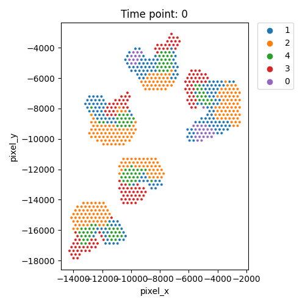 | 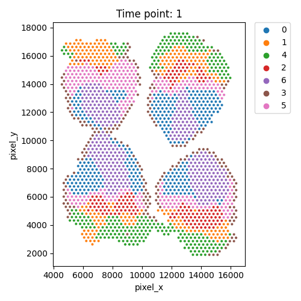 | 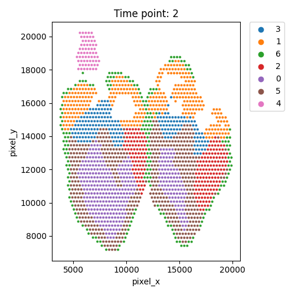 | 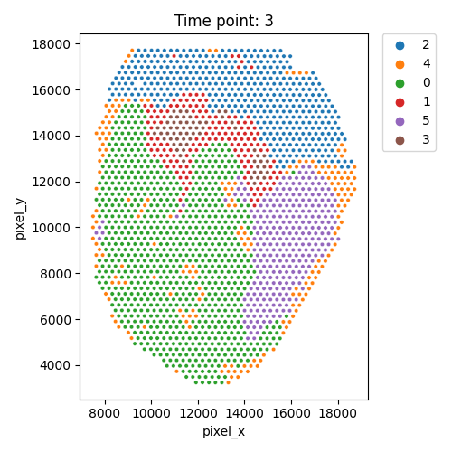 | 

#### Output OT analysis

| Timepoint | Day 4 --> Day 7 | Day 7 --> Day 10 | Day 10 --> Day 14 | 
|-----------|-----------------|------------------|-------------------|
| OT transition | 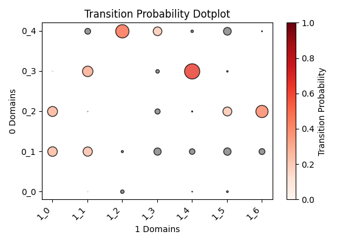 | 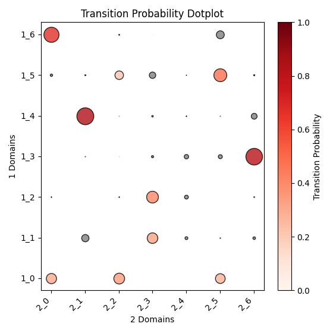 |  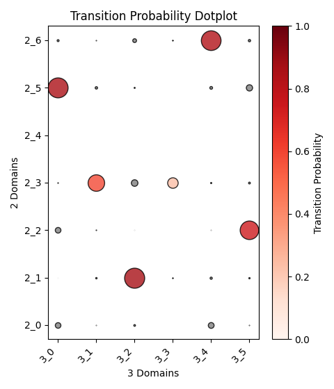 |

**Step 5: infer spatial domains and domain dynamics based on Elbow method (Optional)**

Or, we can leave out the `--n_clusters` option, then SpaDOT would automatically run Elbow method to determine the number of clusters

```
SpaDOT analyze --data latent.h5ad
```

We then have the plot of calculating the within-cluster sum of squares (WSS) of KMeans with the number of clusters ranging from 5 to 20. We then  detect the Elbow point and select the corresponding cluster number.


### Output WSS per cluster and spatial domains

| Timepoint | Day 4 | Day 7 | Day 10 | Day 14 | 
|-----------|-------|-------|--------|--------|
| WSS per cluster | 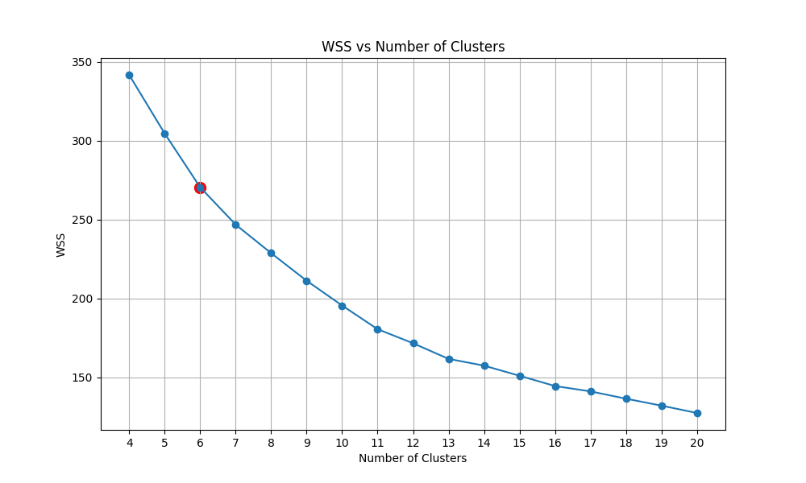 | 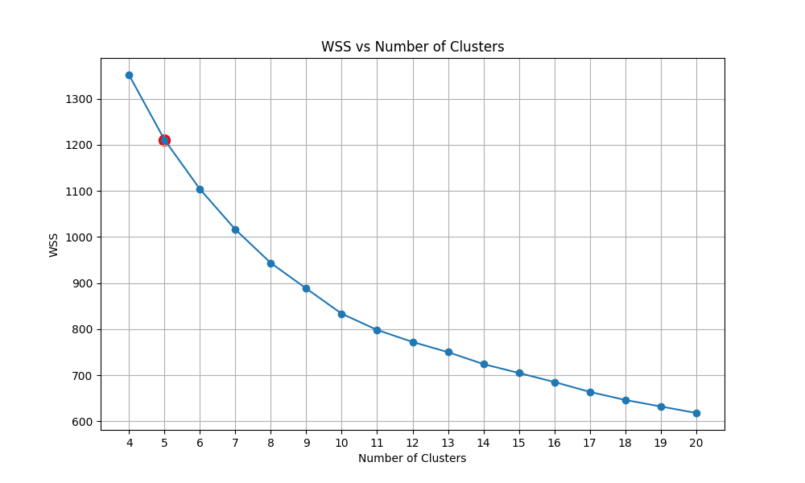 | 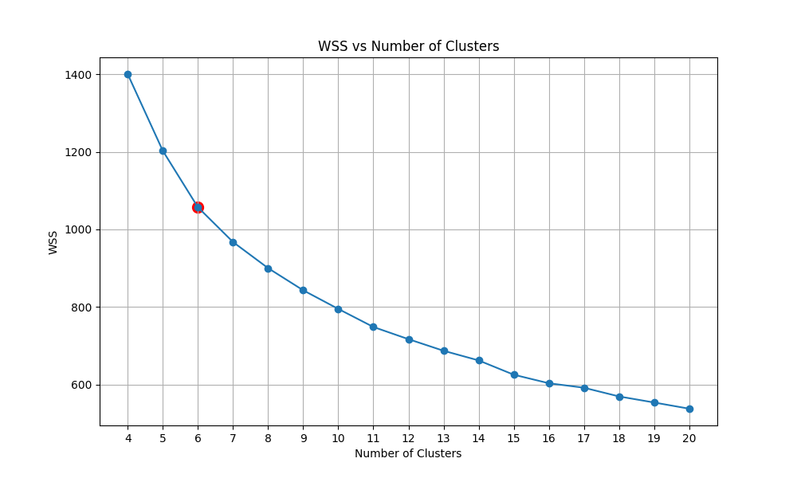 |  | 
| Spatial Domains | 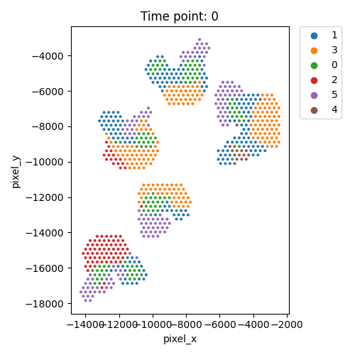 | 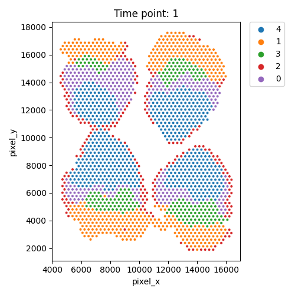 | 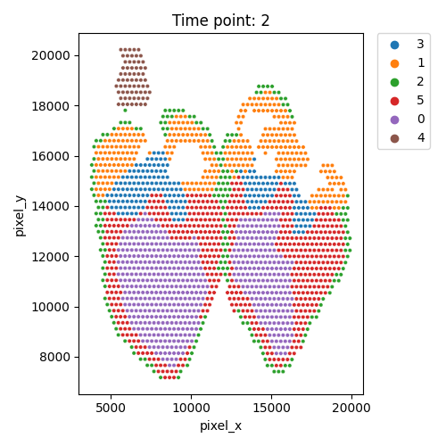 | 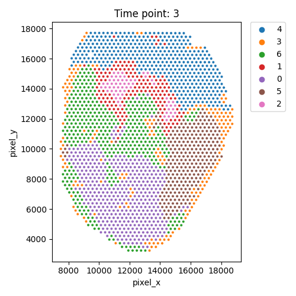 | 

### Output OT analysis

| Timepoint | Day 4 --> Day 7 | Day 7 --> Day 10 | Day 10 --> Day 14 | 
|-----------|-----------------|------------------|-------------------|
| OT transition | 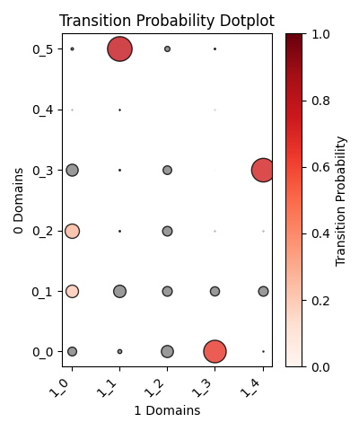 | 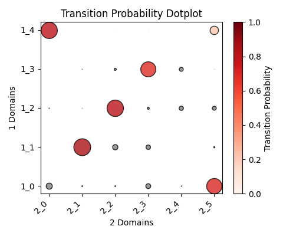 |  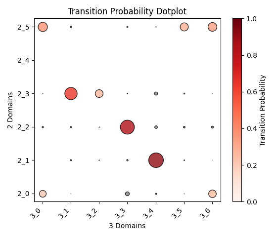 |


# Conclusion

SpaDOT provides efficient and accurate spatial domain detection for spatiotemporal transcriptomics studies and offers insights into domain transition dynamics. Its contributions are three-fold:

1. **Capturing domain dynamics via optimal transport (OT) constraints**: Across time points, OT constraints guide the alignment of functionally similar domains while separating dissimilar ones, enabling SpaDOT to accurately identify both shared and time-specific domains and infer their biological relationships over time.

2. **Modeling both global and local spatial patterns for enhanced structural embedding**: Within each time point, SpaDOT integrates a Gaussian Process (GP) prior and Graph Attention Transformer (GAT) within a variational autoencoder (VAE) framework, capturing both global spatial continuity and local structural heterogeneity.

3. **Eliminating the need to predefine the number of spatial domains**: Unlike existing methods, SpaDOT does not require the number of domains to be specified in advance, reducing dependence on prior knowledge and improving ease of use.

We hope that SpaDOT will be a useful tool for your research.

For questions or comments, please open an issue on [Github](https://github.com/marvinquiet/SpaDOT/issues).

<!--**Citation**-->

